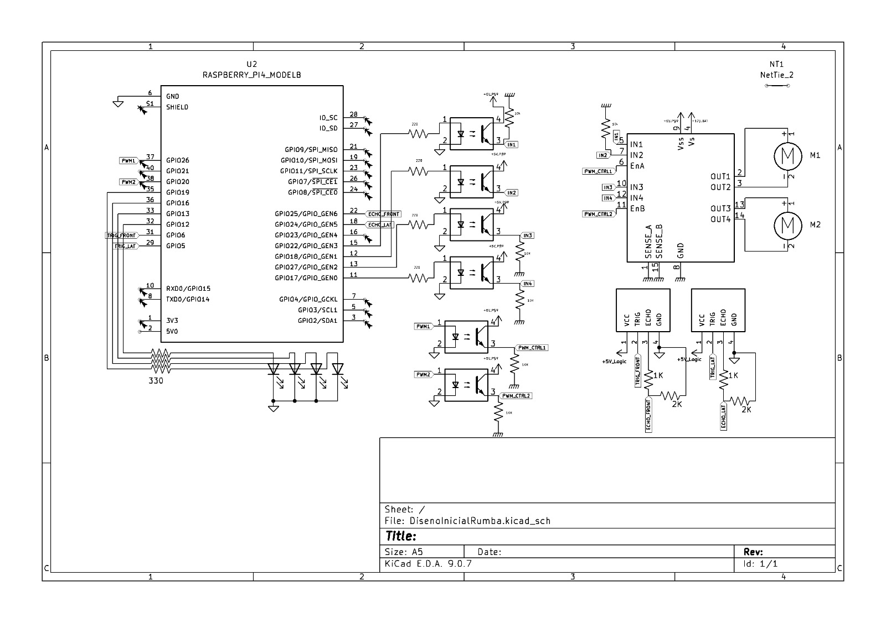

# Proyecto1_RobotYocto---Sistemas-Empotrados
Este repositorio contiene el desarrollo del Proyecto 1 del curso de Sistemas Empotrados (IS2026), el cual consiste en el diseño e implementación de un robot aspiradora autónomo basado en una Raspberry Pi 4 y un sistema operativo Linux mínimo construido con Yocto.

El sistema integra múltiples subsistemas de hardware y software para crear una plataforma embebida completa, capaz de operar tanto de forma autónoma como de forma manual mediante una aplicacion web. 

## Hardware Necesario

### Unidad de procesamiento
-1 × Raspberry Pi 4 Model B
-1 × Tarjeta microSD
-1 × Fuente de alimentación 5V (≥3A, recomendada para Raspberry Pi)

### Sistema de audio

-1 × Amplificador de audio LM386
-1 × Bocina / Altavoz (4-8)Ω
-1 × Cable de audio Jack 3.5 mm
- Resistencias y Capacitores
-1 × Potenciómetro de 10 kΩ

A continuacion, se muestre el digrama del circuito de audio completo.


### Sistema de motores
- 2 × Motores DC
- 1 × Driver de motores tipo puente H (ej. L298N o similar)
- Fuente de alimentación para motores (ej. 6V–12V dependiendo del motor)
- 6 × Optoacopladores (para aislar la Raspberry del driver y otras cargas)
- Resistencias asociadas (1-2) kΩ

A continuacion, se muestre el digrama del circuito de los motores con puente H completo.



### Otros componentes

- LEDs indicadores
- 3 × Sensores ultrasónicos HC-SR04
- Cables Dupont (M-M, M-H)

## Software Necesario

- Yocto Project
  Poky  
  Scarthgap Release  
  Toolchain-SDK (ARM)  
- Sistema Operativo
  Imagen mínima de Linux generada con Yocto  
  Optimizada para recursos limitados  
-Software Embebido
  Biblioteca dinámica en C (.so) para manejo de hardware (GPIO, PWM, audio)  
  Servidor web para control remoto  
  Procesos concurrentes (navegación + audio)  
-Comunicación
  Interfaz web accesible vía red (WiFi)  
- `bmaptool` (para grabar la imagen en la microSD)  

## Layer necesarios para la imagen

Se debe tener bblayers asociados a la imagen, especialmente meta-raspberrypi y meta-openembedded para que todo el Wifi y el jack funcionen correctamente. Primeramente asegurarse de contar con los repositorios necesarios.

```bash
git clone -b scarthgap https://github.com/agherzan/meta-raspberrypi.git
git clone -b scarthgap https://github.com/openembedded/meta-openembedded.git
```
A continuacion, se deben agregar los layer mediante:

```bash
bitbake-layers add-layer ../meta-raspberrypi
bitbake-layers add-layer ../meta-openembedded/meta-oe
bitbake-layers add-layer ../meta-openembedded/meta-python
bitbake-layers add-layer ../meta-openembedded/meta-multimedia
bitbake-layers add-layer ../meta-openembedded/meta-networking
bitbake-layers add-layer ../meta-robot
```

```bash

# POKY_BBLAYERS_CONF_VERSION is increased each time build/conf/bblayers.conf
# changes incompatibly
POKY_BBLAYERS_CONF_VERSION = "2"

BBPATH = "${TOPDIR}"
BBFILES ?= ""

BBLAYERS ?= " \
  /media/javier/disco-externo/yocto/poky-scarthgap/meta \
  /media/javier/disco-externo/yocto/poky-scarthgap/meta-poky \
  /media/javier/disco-externo/yocto/poky-scarthgap/meta-yocto-bsp \
  /media/javier/disco-externo/yocto/poky-scarthgap/meta-raspberrypi \
  /media/javier/disco-externo/yocto/poky-scarthgap/meta-openembedded/meta-oe \
  /media/javier/disco-externo/yocto/poky-scarthgap/meta-openembedded/meta-python \
  /media/javier/disco-externo/yocto/poky-scarthgap/meta-openembedded/meta-multimedia \
  /media/javier/disco-externo/yocto/poky-scarthgap/meta-openembedded/meta-networking \
  /media/javier/disco-externo/yocto/poky-scarthgap/meta-robot \
  "

```

## Archivo local.conf

En el archivo de configuracion no es recomendable incluir modulos de kernel especificos, sino solo dependencias,licencias, configuraciones, parametros, etc. Como por ejemplo bibliotecas u otros servicios de inicializacion como systemd, archivo txt de audio, parametros habilitados y demas.

```bash

# ─────────────────────────────────────────────
#  Yocto local.conf – Raspberry Pi 4 Model B
# ─────────────────────────────────────────────
CONF_VERSION = "2"
MACHINE      = "raspberrypi4-64"
DISTRO       = "poky"

# ── Init manager ──────────────────────────────
DISTRO_FEATURES:append = " systemd usrmerge wifi"
DISTRO_FEATURES_BACKFILL_CONSIDERED += "sysvinit"
VIRTUAL-RUNTIME_init_manager = "systemd"
VIRTUAL-RUNTIME_initscripts  = "systemd-compat-units"

# ── Machine features ──────────────────────────
MACHINE_FEATURES:append = " wifi alsa"

# ── Licenses ─────────────────────────────────
LICENSE_FLAGS_ACCEPTED = "synaptics-killswitch"

# ── WiFi + Audio  ───────────────────────────
ENABLE_WIFI  = "1"
ENABLE_UART  = "1"
ENABLE_AUDIO = "1"
DISABLE_VC4GRAPHICS = "1"

KERNEL_MODULE_AUTOLOAD += "cfg80211 brcmfmac brcmfmac-wcc brcmutil rfkill snd-bcm2835"

MACHINE_EXTRA_RRECOMMENDS += " \
    linux-firmware-rpidistro-bcm43455 \
    linux-firmware-rpidistro-bcm43456 \
"

# ── Audio config.txt ──────────────────────────
RPI_EXTRA_CONFIG:append = "\ndtparam=audio=on\naudio_pwm_mode=2\n"

# ── Extra - Optimization ──────────────────────────────
EXTRA_IMAGE_FEATURES += "debug-tweaks"
INHERIT += "rm_work"
RM_WORK_EXCLUDE += "robot-image"

```

### Creacion de Meta-robot

## Receta robot-yocto.bb

En este archivo es importante tener en cuenta todas las bibliotecas que se utilizan en el servidor, ademas lo mas importante es agregar los kernel-modules especificos a la imagen, para esto se deben buscar los paquetes especificos dependiendo de la version de uso, para este caso la version 6.6.63-v8. Se puede hacer uso de los siguientes comandos para buscar los paquetes de interes:

## Verificar el nombre exacto de los modulos de kernel en Yocto

Por ejemplo el kernel-module-brcmfmac, ya que este puede estar incluido en IMAGE_INSTALL, pero no necesariamente carga el modulo brcmfmac.ko, el cual es el driver necesario para el servicio de Wifi.

```bash

bitbake -e virtual/kernel | grep "^PACKAGES"
oe-pkgdata-util list-pkgs | grep brcm

```
Resultado obtenido:

```bash

PACKAGES="kernel kernel-base kernel-vmlinux kernel-image kernel-dev kernel-modules kernel-dbg kernel-image-image kernel-devicetree"
PACKAGESPLITFUNCS="split_kernel_packages split_kernel_module_packages                  package_do_split_locales                 populate_packages"
PACKAGES_DYNAMIC="^linux-raspberrypi-locale-.* ^kernel-module-.* ^kernel-image-.* ^kernel-firmware-.*"
kernel-module-brcmfmac-6.6.63-v8
kernel-module-brcmfmac-bca-6.6.63-v8
kernel-module-brcmfmac-cyw-6.6.63-v8
kernel-module-brcmfmac-wcc-6.6.63-v8
kernel-module-brcmutil-6.6.63-v8
kernel-module-i2c-brcmstb-6.6.63-v8

```
Esto se debe considerar para los distintos kernel-modules que se requieran en la imagen, se debe prestar atencion a la version correspondiente, ya que esta puede variar segun el caso.

## Receta robot-image.bb

En esta receta se incluyeron bibliotecas y servicios como mpg123, ALSA, libmicrohttpd, wpa_supplicant, etc, y diferentes kernel-modules especificos con su respectiva version.

```bash

require recipes-core/images/core-image-minimal.bb

SUMMARY = "Imagen Robot Vacuum para Raspberry Pi 4"

IMAGE_INSTALL:append = " \
    librobot               		\
    robot-server                        \
    libmicrohttpd                       \
    mpg123                              \
    alsa-utils                          \
    alsa-config                         \
    pigpio	                        \
    libpigpio               		\
    pigpio-bin-pigpiod      		\
    wpa-supplicant                      \
    wifi-config                         \
    wireless-regdb-static               \
    linux-firmware-rpidistro-bcm43455   \
    iw                                  \
    rfkill                              \
    dhcpcd                              \
    openssh-sftp-server                 \
    kernel-module-brcmfmac-6.6.63-v8       \
    kernel-module-brcmfmac-wcc-6.6.63-v8   \
    kernel-module-brcmutil-6.6.63-v8       \
    kernel-module-snd-6.6.63-v8            \
    kernel-module-snd-pcm-6.6.63-v8        \
    kernel-module-snd-bcm2835-6.6.63-v8    \
"

IMAGE_FEATURES += "ssh-server-openssh"

IMAGE_ROOTFS_SIZE ?= "204800"
IMAGE_ROOTFS_EXTRA_SPACE ?= "0"

```

## Receta para la Biblioteca dinamica
```bash
SUMMARY = "Robot hardware shared library"
LICENSE = "CLOSED"

SRC_URI = "file://lib_audio.c   \
           file://lib_audio.h   \
           file://lib_leds.c    \
           file://lib_leds.h    \
           file://lib_motors.c  \
           file://lib_motors.h  \
           file://lib_sensors.c \
           file://lib_sensors.h \
           file://robot_state.h \
           file://CMakeLists.txt"

S = "${WORKDIR}"

DEPENDS = "mpg123 alsa-lib pigpio"

inherit cmake

FILES:${PN}     = "${libdir}/librobot.so.1* "
FILES:${PN}-dev = "${libdir}/librobot.so ${includedir}/robot/*.h"

```

## CMakeLists.txt (Biblioteca dinámica y servidor)

Este ejemplo muestra la configuración de CMake para compilación cruzada usando el Toolchain-SDK (ARM) de la biblioteca dinámica.

El CMake del servidor se encuentra en:
`meta-robot/recipes-robot/robot-server/files/src/`

```bash
cmake_minimum_required(VERSION 3.16)
project(robot VERSION 1.0 LANGUAGES C)

# Buscar dependencias
find_library(PIGPIOD_IF2_LIB pigpiod_if2 REQUIRED)
find_library(ASOUND_LIB asound REQUIRED)
find_library(MPG123_LIB mpg123 REQUIRED)

find_path(PIGPIOD_INCLUDE pigpiod_if2.h)
find_path(ALSA_INCLUDE alsa/asoundlib.h)
find_path(MPG123_INCLUDE mpg123.h)

# Crear biblioteca dinamica
add_library(robot SHARED
    lib_audio.c
    lib_leds.c
    lib_motors.c
    lib_sensors.c
)

# Headers propios
target_include_directories(robot PUBLIC
    ${CMAKE_CURRENT_SOURCE_DIR}
    ${CMAKE_CURRENT_BINARY_DIR}
    ${PIGPIOD_INCLUDE}
    ${ALSA_INCLUDE}
    ${MPG123_INCLUDE}
)

# Linking
target_link_libraries(robot
    ${PIGPIOD_IF2_LIB}
    ${ASOUND_LIB}
    ${MPG123_LIB}
    pthread
)

# Version del .so
set_target_properties(robot PROPERTIES
    VERSION 1.0.0
    SOVERSION 1
    PUBLIC_HEADER "lib_audio.h;lib_leds.h;lib_motors.h;lib_sensors.h"
)

# Instalacion
include(GNUInstallDirs)
install(TARGETS robot
    LIBRARY DESTINATION ${CMAKE_INSTALL_LIBDIR}
    PUBLIC_HEADER DESTINATION ${CMAKE_INSTALL_INCLUDEDIR}/robot
)
```

# Credenciales Wifi

Se deben cambiar las credenciales del Wifi correspondiente, asi como el codigo de pais, en el archivo /meta-robot/recipes-connectivity/wifi-config/files/wpa_supplicant-wlan0.conf


```bash

ctrl_interface=/run/wpa_supplicant
update_config=1
country=COUNTRY_CODE_EXAMPLE:CR

network={
    ssid="Red_Wifi_name"
    psk="password"
    scan_ssid=1
}

```

Una vez cambiados los credenciales, se debe hacer rebuild de la siguiente manera:

```bash

bitbake -c cleansstate wifi-config && bitbake robot-image

```

# Creacion de la imagen

Antes de iniciar, se debe inicializar el entorno build, mediante el comando:

```bash

source oe-init-build-env

```
## Imagen robot-image

1. Primeramente se debe contar con una  imagen minimal, donde no estara el servidor del robot, pero si tendra los servicios minimos deseados como Wifi y salida de audio

```bash

bitbake core-image-minimal

```

2. Para crear la imagen con el meta-robot se necesita asegurarse de incluir el layer en el archivo bblayers, despues ejecutar el comando:

```bash

bitbake robot-image

```

## Comandos de utilidad

1. En caso de cambiar parametros del kernel, se recomienda hacer una limpieza para bitbake, necesaria para eliminar archivos residuales de imagenes anteriores

```bash

bitbake -c cleansstate virtual/kernel

```

2. Menu de configuracion del kernel, para en caso de necesitar activas opciones adicionales de kernel:

```bash

bitbake -c menuconfig virtual/kernel
bitbake -c cleansstate core-image-minimal

```

3.  Verificar el size de la imagen resultante

```bash

ls -lh tmp/deploy/images/raspberrypi4-64/nombre_de_la_imagen.wic.bz2

```

## Verificacion Adicional

Antes de flashear la imagen, es recomendable verificar que se encuentra listo todo lo necesario para las funcionalidades principales, se recomienda ejecutar esta serie de comandos para validad cada seccion.

```bash

ROOTFS="tmp/work/raspberrypi4_64-poky-linux/robot-image/1.0/rootfs"

echo "=== BRCM ===" 
find $ROOTFS/usr/lib/modules -name "*.ko.xz" | grep brcm | sort

echo "=== SND ===" 
find $ROOTFS/usr/lib/modules -name "*.ko.xz" | grep snd | sort

echo "=== FIRMWARE ===" 
ls $ROOTFS/lib/firmware/brcm/ | grep 43455

echo "=== SYSTEMD WANTS ===" 
ls -la $ROOTFS/etc/systemd/system/multi-user.target.wants/

echo "=== WPA CONFIG ===" 
cat $ROOTFS/etc/wpa_supplicant/wpa_supplicant-wlan0.conf

echo "=== ASOUND ===" 
cat $ROOTFS/etc/asound.conf 2>/dev/null || echo "NOT FOUND"

echo "=== MODULES-LOAD ===" 
cat $ROOTFS/usr/lib/modules-load.d/brcmfmac.conf 2>/dev/null
echo "=== MODULES-LOAD WCC ===" 
cat $ROOTFS/usr/lib/modules-load.d/brcmfmac-wcc.conf 2>/dev/null || echo "NO EXISTE"

```

Verificar que la biblioteca dinamica librobot.so existe en la imagen
```bash
find tmp/deploy -name "librobot*" 2>/dev/null
```

Ver el manifest completo
```bash
grep -E "librobot|robot-server|pigpio" \
    tmp/deploy/images/raspberrypi4-64/robot-image-raspberrypi4-64.rootfs.manifest
```

Obtener el log de compilación cruzada

Para verificar la compilación cruzada, se puede inspeccionar el log generado durante el proceso de build.

```bash
# Log de compilación de librobot
cat tmp/work/cortexa72-poky-linux/librobot/1.0/temp/log.do_compile

# Log de compilación del servidor
cat tmp/work/cortexa72-poky-linux/robot-server/1.0/temp/log.do_compile

```

En el log debería observarse el uso del compilador cruzado, por ejemplo:

`aarch64-poky-linux-gcc ... -mcpu=cortex-a72 ... -o librobot.so`

# Flashear imagen a la tarjeta SD

Para flashear la imagen se debe ejecutar una serie de comandos, para esto es necesario tener instalada la herramienta de bmap-tools, la cual se puede instalar con el comando:


```bash

sudo apt update
sudo apt install bmap-tools

```
Adicionalmente, con `df -h`  podemos observar el nombre de la SD card

## Pasos para flashear la imagen

1. Desmontar el sistema de archivos

```bash

sudo umount /route/sd_card/boot
sudo umount /route/sd_card/root

```

2. Ir al directorio donde quedo la imagen resultante

```bash

cd ../yocto/poky-scarthgap/build/tmp/deploy/images/raspberrypi4-64/

```
3. Flashear/copiar la imagen al dispositivo SD

```bash

sudo bmaptool copy robot_image_name.wic.bz2 /dev/sd_card_name

```
4. Finalmente, expulsar de forma segura la tarjeta SD

```bash

sudo eject /dev/sd_card_name

```

Una vez completado este proceso, la tarjeta microSD puede insertarse en la Raspberry Pi 4 para iniciar con la imagen generada. Como consideración adicional, el sistema está configurado para iniciar sesión con el usuario root.

# Verificación en la Raspberry Pi

## Estado del servidor, lib, wpa_supplicant
```bash
systemctl status robot-server
systemctl status pigpiod
systemctl status wpa_supplicant
```
## Logs en tiempo real del servidor
```bash
journalctl -u robot-server -f
```
## Verificar biblioteca dinámica
```bash
ls /usr/lib/librobot.so*
```
## Verificar archivos del servidor
```bash
ls /opt/robot/www/
ls /opt/robot/audio/
```
## Verificar que escucha en puerto 8080
```bash
cat /proc/net/tcp6 | grep 1F90
```
## Verificar WiFi | Observar IP
```bash
ip a
systemctl status wpa_supplicant@wlan0
```
## Acceso al servidor
```bash
http://<IP-de-la-RPi>:8080
```

